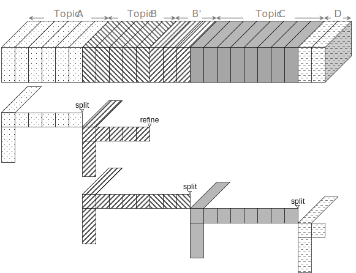

# [DAO-CP](https://datalab.snu.ac.kr/dao-cp/)
This project is a TensorLy implementation of DAO-CP: data adaptive online CP decomposition ([PLOS ONE](https://journals.plos.org/plosone/)).  
This paper proposes a fast and accurate data-adaptive online CP factorization algorithm for high-order tensors. 

## Prerequisites
- Python 3.6+
- [NumPy 1.19.1](https://numpy.org)
- [TensorLy 0.4.5](http://tensorly.org)
- [Pandas 1.1.1](https://pandas.pydata.org/)
- [SciPy 1.5.2](https://www.scipy.org/)

## Usage
* You can run the demo script by `bash demo.sh <dataset_name>`,  
which simply moves to `src/` and runs `python main.py <dataset_name>`.
  * You can choose a dataset for demo (synthetic, video, stock, hall, korea).
* The script creates a tensor stream, performs online decomposition by various methods, and stores estimated tensors at `out/`.
  * Methods includes *Full-CP*, *OnlineCP*, *DTD*, and our proposed method *DAO-CP*.
  * Check decomposition results by loading `.npy` files.
* You can change the dataset and function parameters by modifying `src/main.py`.
* The core functions are implemented in `src/dao-cp`.

## Datasets
| Name | Order | Dimensions | Batch Sizes | Rank | `L_s` | `L_r` |
|:--|:--|:--|:--|:--|:--|:--|
| synthetic	| 4 | (1K, 10, 20, 30) 		| [10] * 100 	| 30 | 1.2 | 1.1 |
| video		| 4 | (205, 240, 320, 3) 	| [5] * 41 		| 30 | 6.0 | 2.0 |
| stock 	| 3 | (3K, 140, 5) 			| [3] * 1K	 	| 20 | 6.0 | 5.0 |
| hall		| 3 | (200, 144, 176) 		| [10] * 20 	| 20 | 0.5 | 0.1 |
| korea 	| 3 | (10K, 323, 6) 		| [100] * 100	| 20 | 2.0 | 1.3 |
